# Исследование JVM через VisualVM

После запуска программы мы видим уведомление об этом в консоле, где нас просят открыть вкладку ru.netology.JvmExperience в VisualVm:

    20:48:35: Executing ':JvmExperience.main()'...

    > Task :compileJava UP-TO-DATE
    > Task :processResources NO-SOURCE
    > Task :classes UP-TO-DATE

    > Task :JvmExperience.main()
    Please open 'ru.netology.JvmExperience' in VisualVm

Спустя 30 секунд - в 20:49:06 - происходит загрузка классов из пакета io.vertx:

    20:49:06.087223200: loading io.vertx
    20:49:06.531395800: loaded 529 classes

Загрузка завершается за ~0.44с.
Визуально это также отражается ростом на графиках Classes и Metaspace:

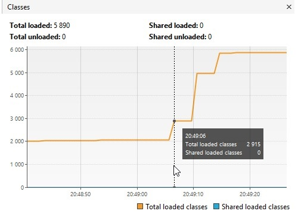
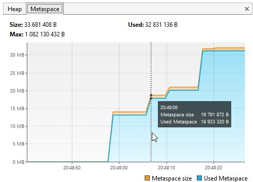

Спустя 3 секунды - в 20:49:09 - происходит загрузка классов из пакета io.netty:

    20:49:09.536798800: loading io.netty
    20:49:10.634551800: loaded 2117 classes

Загрузка завершается за ~1.1с.
Визуально это также отражается ростом на графиках Classes и Metaspace:

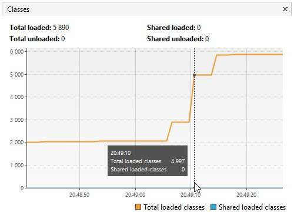
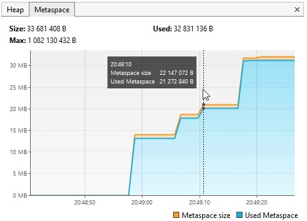

Спустя ещё 3 секунды - в 20:49:13 - происходит загрузка классов из пакета io.netty:

    20:49:13.639936400: loading org.springframework
    20:49:13.953021800: loaded 869 classes

Загрузка завершается за ~0.34с.
Визуально это также отражается ростом на графике Classes, однако график Metaspace остаётся неизменным:

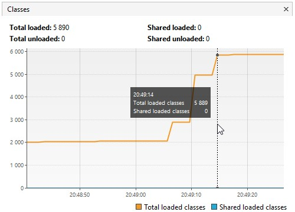
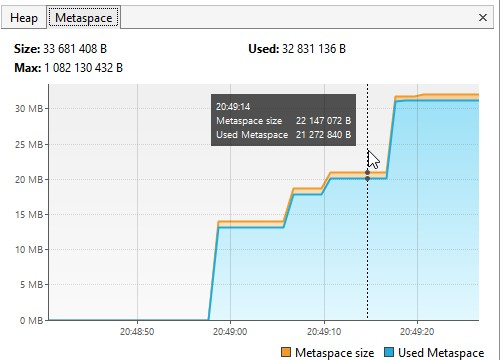

После следующей задержки в 3 секунды нас просят обратить внимание на график во вкладке Heap. Создаётся 5000000 новых объектов:

    20:49:16.960038700: now see heap
    20:49:16.960038700: creating 5000000 objects
    20:49:17.286345600: created

Создание объектов завершается за ~0.32с.
Визуально это также отражается ростом используемой памяти на графике Heap, и т.к. память уже близка к заполнению - JVM выделяет немного больше памяти под Heap:

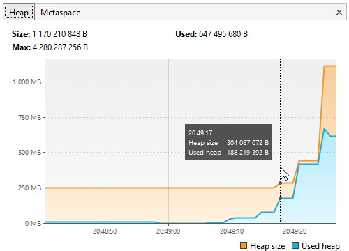

А на графике CPU мы видим активность garbage collector, однако он не смог освободить больше памяти, чем понадобилось под создание объектов. Поэтому мы по-прежнему видели рост используемой на графике Heap.

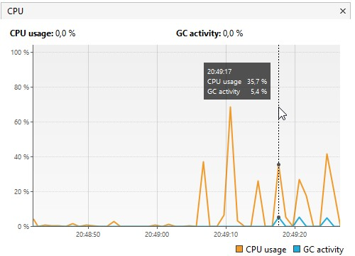

После очередной задержки в 3 секунды создаётся ещё 5000000 новых объектов:

    20:49:20.294098300: creating 5000000 objects
    20:49:20.585662: created
    
Создание объектов завершается за ~0.29с.
Визуально это также отражается ростом используемой памяти на графике Heap, и т.к. память уже близка к заполнению - JVM выделяет немного больше памяти под Heap:

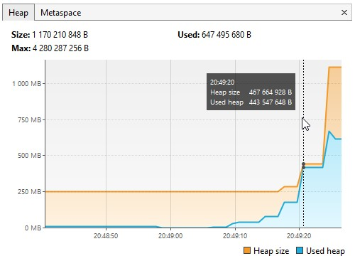

А на графике CPU мы видим активность garbage collector, однако он не смог освободить больше памяти, чем понадобилось под создание объектов. Поэтому мы по-прежнему видели рост используемой на графике Heap.

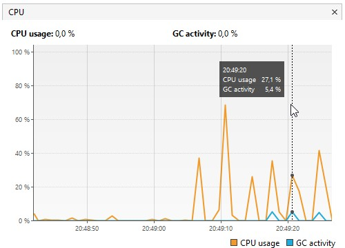

После следующей задержки в 3 секунды создаётся ещё 5000000 новых объектов:

    20:49:23.698051200: creating 5000000 objects
    20:49:24.009835800: created
    
Создание объектов завершается за ~0.3с.
Визуально это также отражается ростом используемой памяти на графике Heap, и т.к. память уже не первый раз близка к заполнению - JVM выделяет намного больший объем памяти под Heap, нежели раньше:

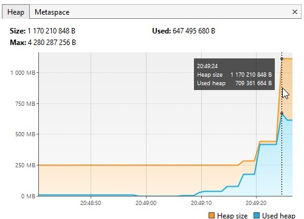

А на графике CPU мы видим активность garbage collector. 

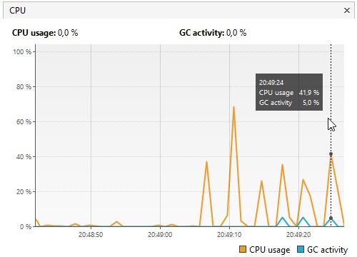

На графике Heap мы видим, что в этот раз ему удалось освободить немного используемой памяти.